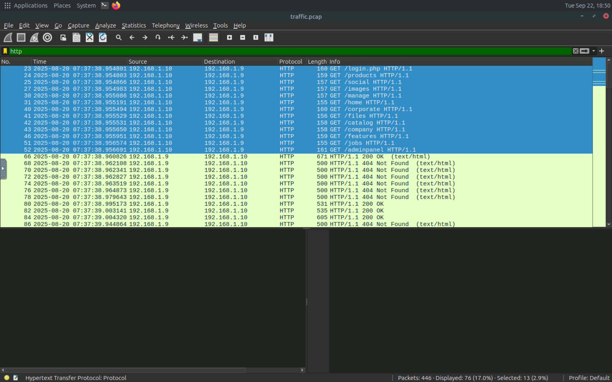
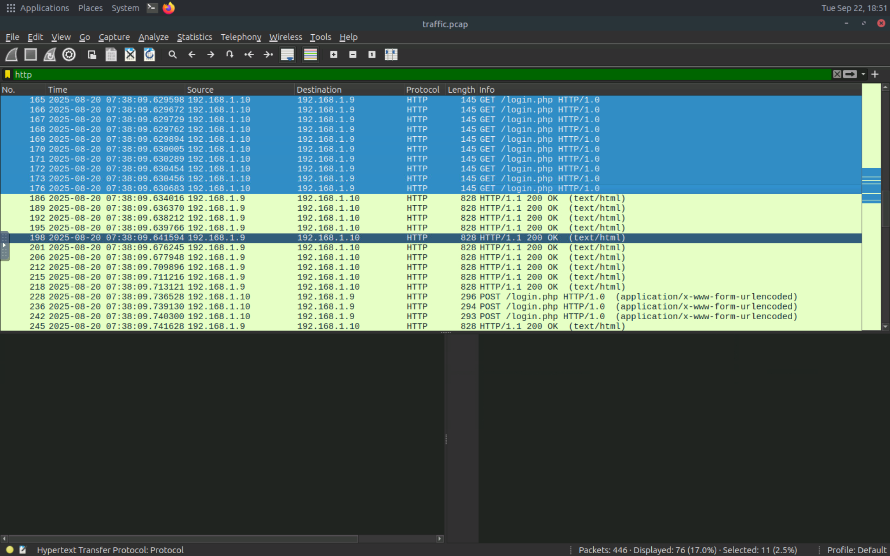
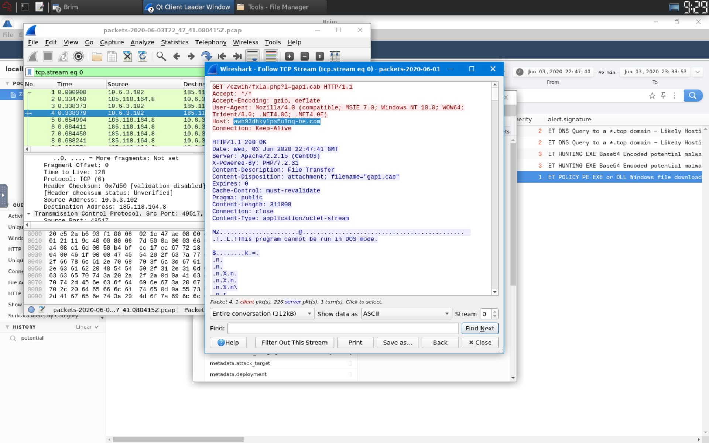
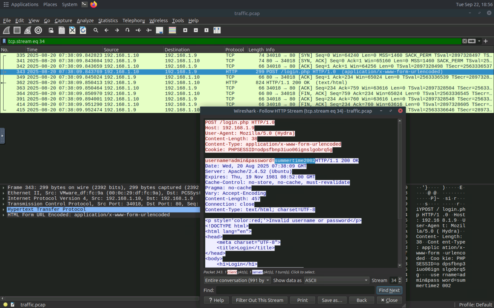
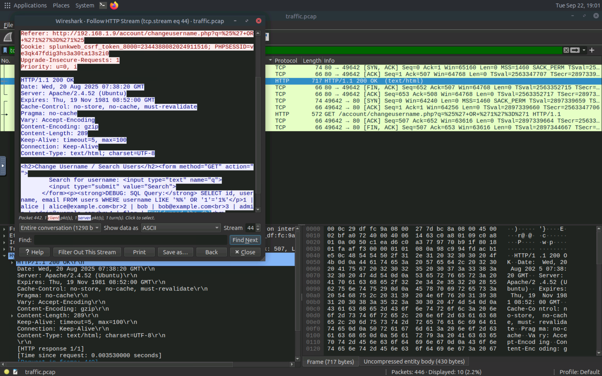
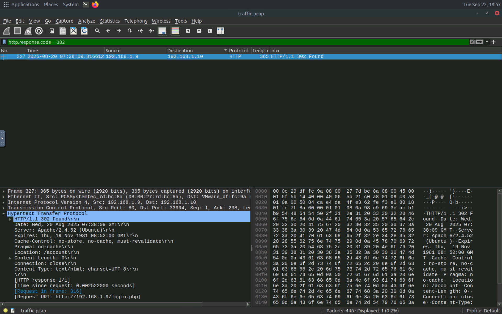
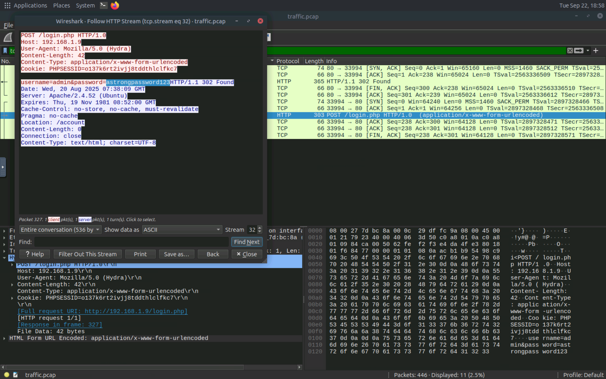

# Network Traffic Analysis

## Overview

Network traffic analysis is an important part of web shell detection and investigation.

In this phase, Wireshark was used to inspect HTTP traffic and TCP streams in order to understand the communication observed during the investigation.

The analysis focused on HTTP traffic, individual TCP streams, and HTTP response codes.

---

## 1. HTTP Traffic Analysis

The following Wireshark filter was used to isolate HTTP traffic:

```text
http
```

Filtering HTTP traffic allows the analyst to focus on web-related communications and inspect the requests and responses exchanged between the client and the web server.

### Evidence





---

## 2. TCP Stream Analysis

TCP streams were examined to isolate specific network conversations.

The following filter was used:

```text
tcp.stream eq 0
```

Examining an individual TCP stream helps the analyst follow a specific communication session and inspect the packets exchanged during that session.

### Evidence



Additional TCP stream analysis was performed during the investigation:





---

## 3. HTTP Response Code Analysis

HTTP response codes were also analyzed to identify relevant server responses.

The following Wireshark filter was used:

```text
http.response.code == 302
```

HTTP status code `302` represents a temporary redirect. Examining these responses can help the analyst understand how the web server responded to specific requests and follow the sequence of web activity.

### Evidence





---

## 4. Findings

Wireshark provided visibility into the network communication associated with the web activity.

The investigation used:

* HTTP traffic filtering
* TCP stream analysis
* HTTP response code analysis
* Packet-level inspection

These techniques help an analyst isolate relevant communications and understand the sequence of requests and responses during a web shell investigation.

---

## 5. Conclusion

Network traffic analysis provides an additional source of evidence when investigating potential web shell activity.

By filtering HTTP traffic, examining TCP streams, and analyzing HTTP response codes, the analyst can investigate the communication between the client and web server and identify traffic that requires further investigation.

This phase complements the previous log-based analysis and contributes to a broader investigation of potential web shell activity.

