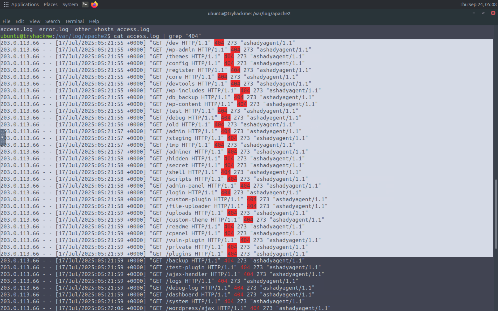
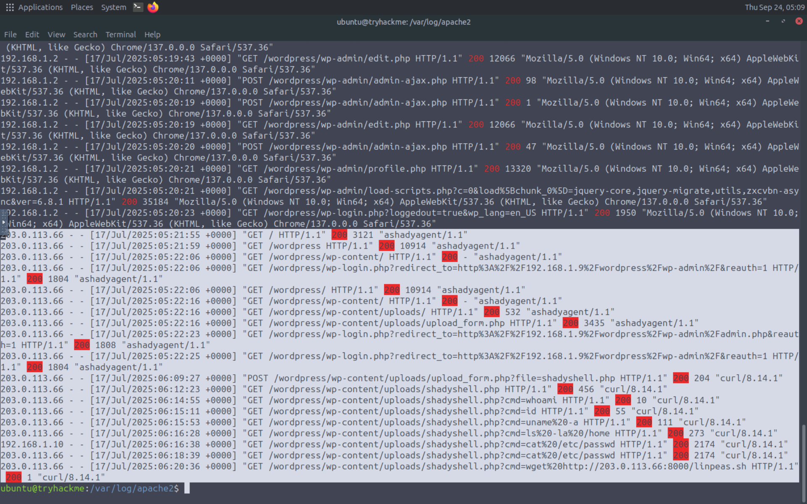
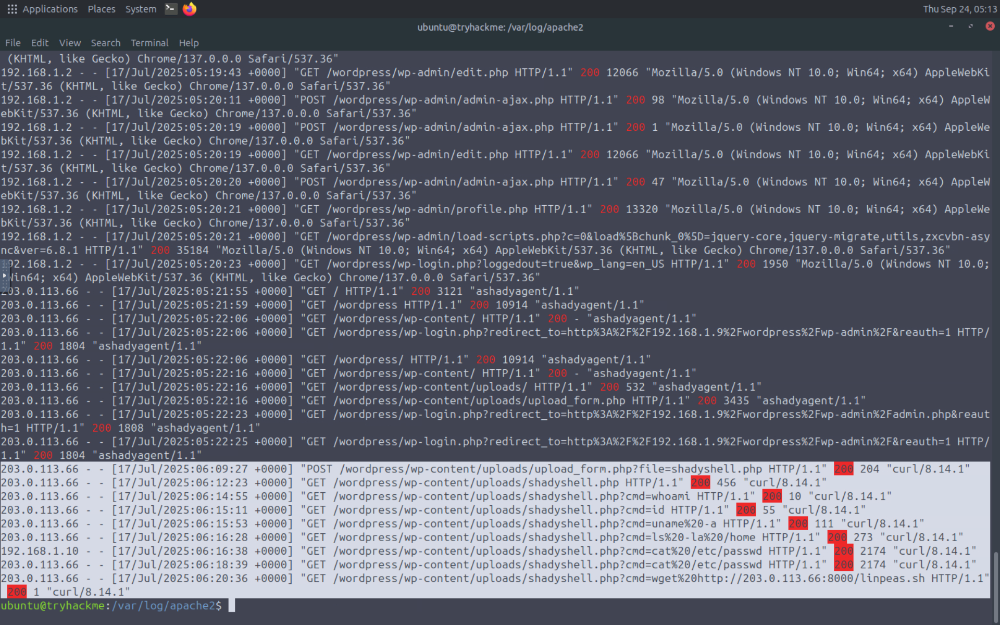
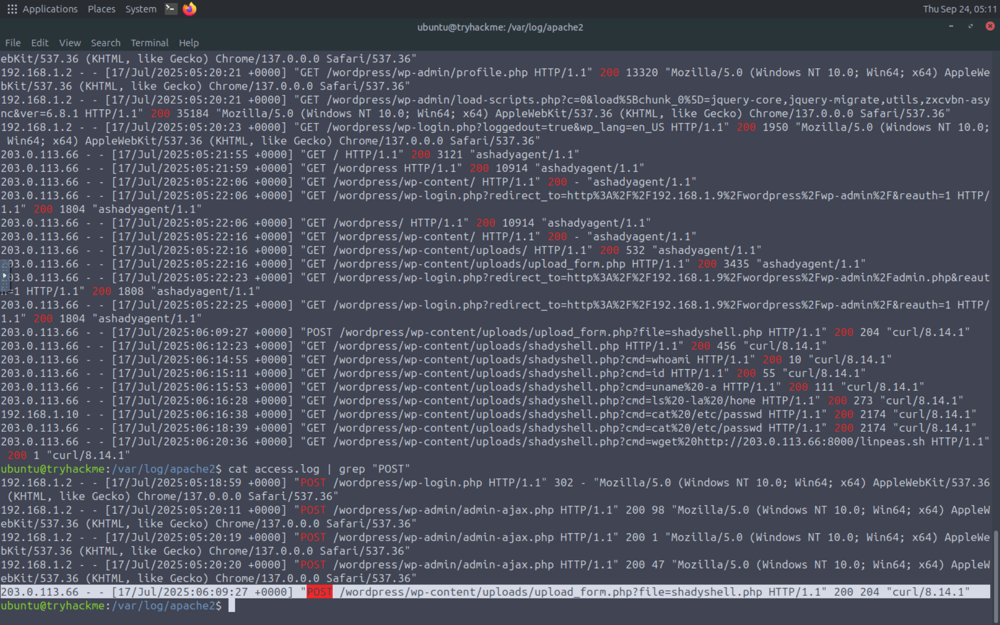

# Investigation

## Overview

This investigation focuses on identifying potential signs of compromise and web shell activity on a WordPress website.

Apache access logs were analyzed to identify suspicious requests, unusual response codes, and HTTP POST activity that could indicate malicious interaction with the web server.

The investigation used the Apache access log as the primary source of evidence.

---

## 1. Apache Access Log

The Apache access log was reviewed to understand the web requests generated against the WordPress website.

The log contains information such as:

* Client IP address
* Timestamp
* HTTP request
* HTTP response code
* Requested resource
* User-Agent

Analyzing these fields helps establish a profile of the observed web activity.

---

## 2. HTTP 404 Requests

The access log was filtered for HTTP `404` responses using:

```bash
cat access.log | grep "404"
```

HTTP `404` responses indicate that the requested resource was not found.

A high number of unsuccessful requests can be useful during an investigation because they may indicate attempts to discover files, directories, or other resources on the web server.

### Evidence



---

## 3. HTTP 200 Requests

The access log was also filtered for HTTP `200` responses:

```bash
cat access.log | grep "200"
```

HTTP `200` indicates that the server successfully processed the request.

Successful requests are important when investigating potential web shell activity because they can show which resources were successfully accessed by the client.

### Evidence





---

## 4. HTTP POST Requests

POST requests were filtered from the access log using:

```bash
cat access.log | grep "POST"
```

POST requests are particularly relevant during web shell investigations because they can be used to send data or commands to a web application.

The requests were reviewed to identify potentially suspicious activity and understand how the attacker interacted with the web server.

### Evidence



---

## 5. Investigation Findings

The Apache access log provided useful evidence for investigating the suspected compromise.

The investigation focused on three important indicators:

* `404` responses — potentially useful for identifying unsuccessful resource discovery attempts.
* `200` responses — showing successfully processed requests.
* `POST` requests — showing data being submitted to the web application.

Analyzing these indicators together can help an analyst understand the sequence of activity and identify requests that require further investigation.

---

## 6. Conclusion

The investigation demonstrates how Apache access logs can be used to identify potential indicators of web shell activity.

Filtering the logs by HTTP response codes and request methods provides a practical way to reduce the amount of data that an analyst needs to review and focus on potentially relevant activity.

The findings from this investigation can be correlated with other evidence sources, such as network traffic and file-system activity, to build a more complete picture of the suspected compromise.

