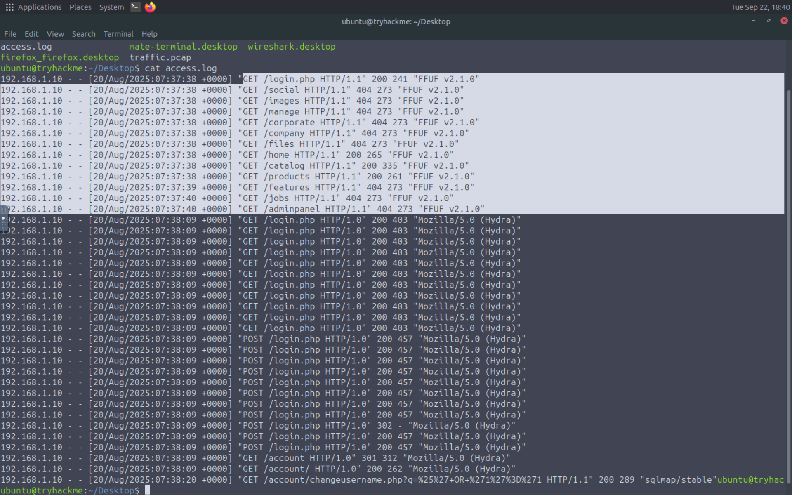
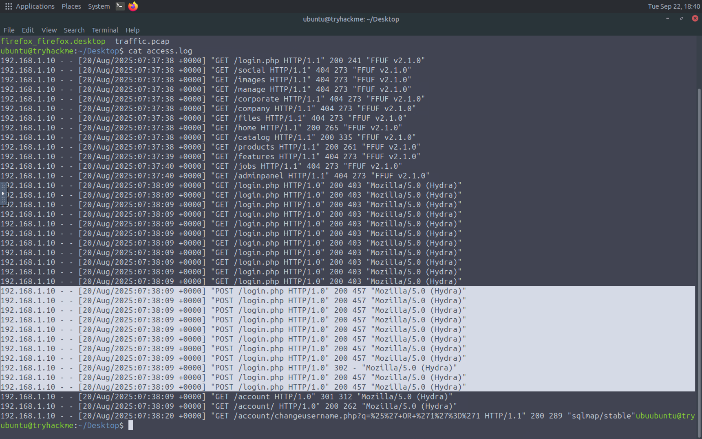
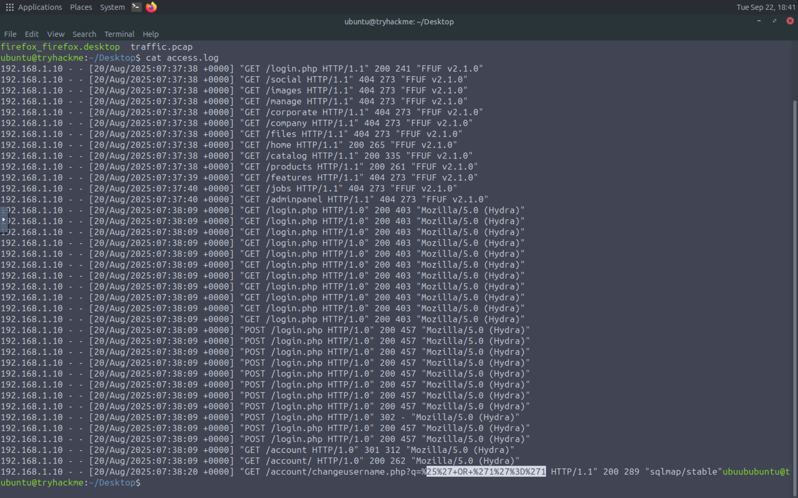

# Log-Based Detection

## Overview

Web server logs are an important source of evidence when investigating potential web shell activity.

They can provide information about client requests, requested resources, timestamps, HTTP methods, source IP addresses, User-Agent strings, and query parameters.

In this investigation, the web server access log was reviewed to identify suspicious activity that could indicate web shell usage.

---

## 1. Web Server Log Analysis

The `access.log` file was examined using the following command:

```bash
cat access.log
```

The purpose of reviewing the access log was to inspect the HTTP requests generated during the activity and identify requests that may be related to malicious web activity.

The log was reviewed for potentially suspicious characteristics such as:

* Unusual HTTP requests
* Suspicious requested files
* Unusual query parameters
* Encoded or obfuscated data
* Repeated requests
* Suspicious client information

### Evidence

The following screenshots show the contents of the web server access log:







---

## 2. Encoded Data Analysis

During the investigation, encoded content was identified in the analyzed data.

CyberChef was used to decode and inspect the encoded content. Decoding suspicious data can help investigators understand the actual information being transmitted and determine whether it contains commands, parameters, or other potentially malicious content.

### CyberChef Analysis


---

## 3. Findings

The access log provided useful evidence for investigating the web activity.

Reviewing the HTTP requests and analyzing encoded content helped provide additional context for identifying potentially malicious behavior associated with web shell activity.

The combination of **web server log analysis** and **encoded data analysis** can help security analysts investigate suspicious web requests and understand the activity observed during an incident.

---

## 4. Conclusion

Web server logs can provide valuable evidence during a web shell investigation.

By reviewing access logs and analyzing suspicious encoded content, an analyst can better understand the requests generated by an attacker and identify indicators that may require further investigation.

This analysis represents the log-based detection phase of the Web Shell Detection investigation.
